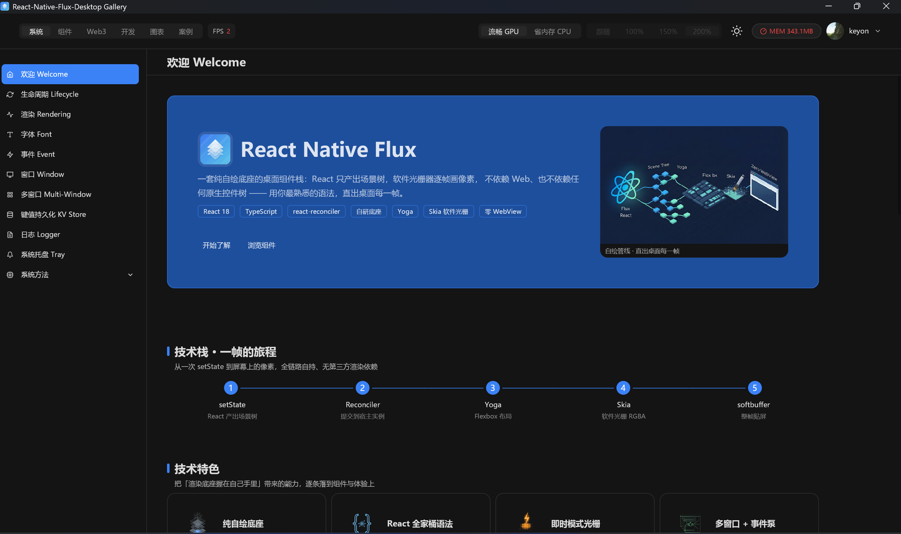
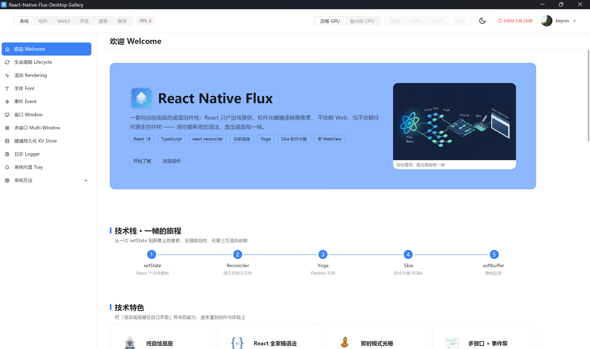
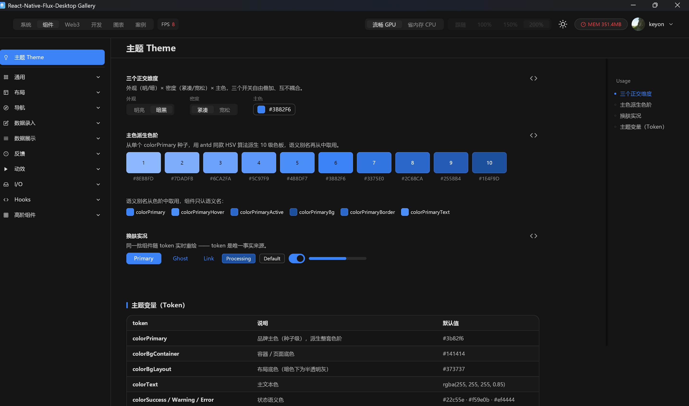
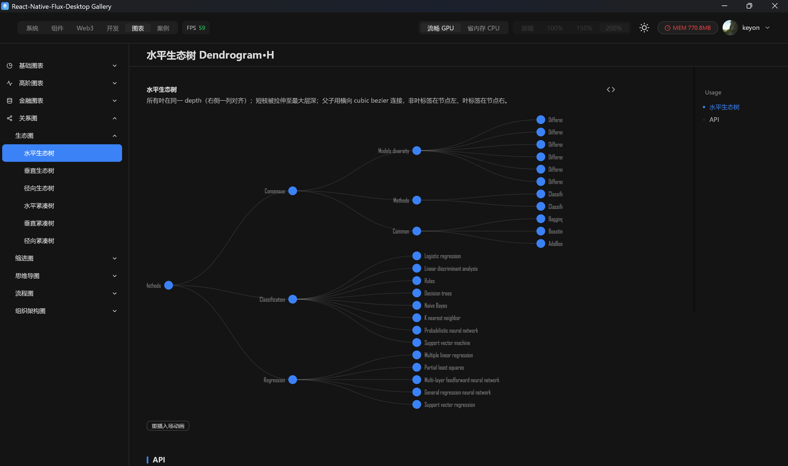
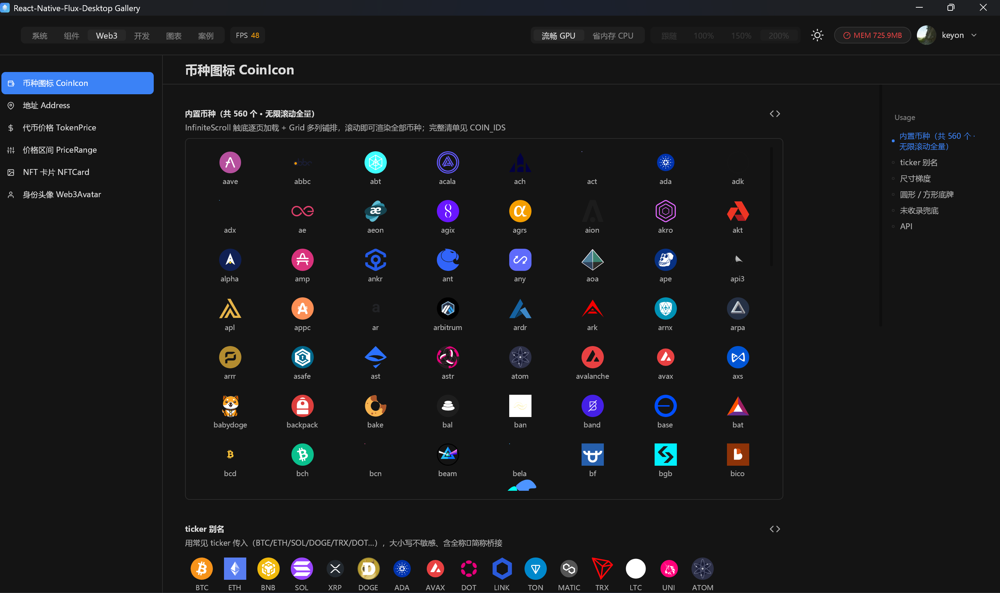
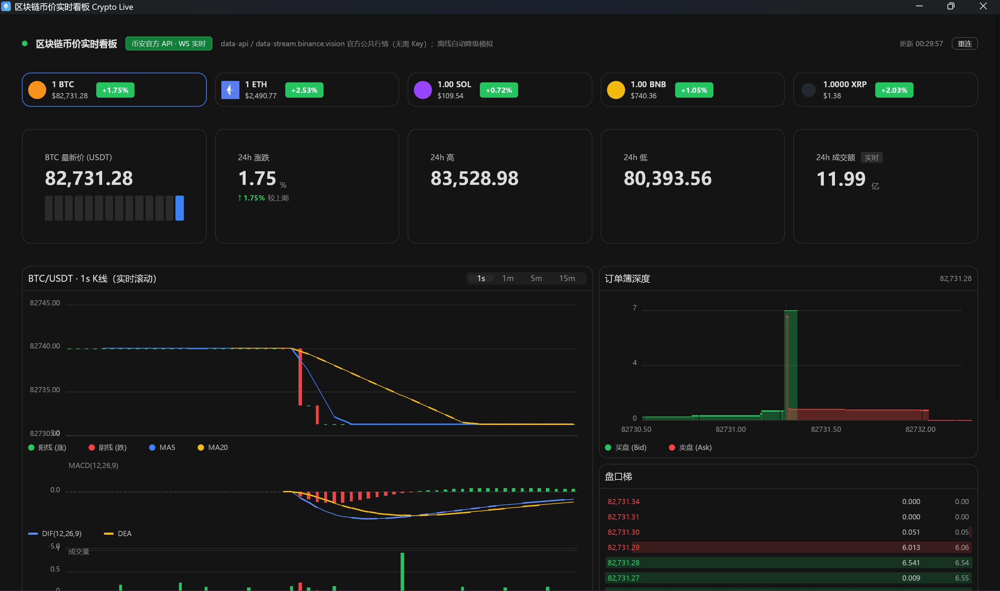

# react-native-flux-desktop

> 🖥️ A self-drawn desktop render stack — build desktop apps in React (JSX); every pixel is painted by Skia onto a window from our self-developed native base. No Electron, no Qt, no native controls.

  

**Depends on:** `@napi-rs/canvas` (Skia raster) · `react-reconciler` · `yoga-layout` · `react` (peer)
**This is the UI core** — the `-chart` / `-pro` / `-dev` / `-web3` / `-webview` packages all take it as a peer dependency to pull core symbols back.

> 📦 This repo is the **compiled distribution**: `index.js` (napi loader) + `*.node` (native binary) + `dist/src` (built library JS + type declarations). Source lives in a separate repo; only the ready-to-`require` artifact is published here.

[中文文档](./README.zh-CN.md)

---

## Gallery

<table>
  <tr>
    <td align="center"><b>Welcome · dark</b><br/></td>
    <td align="center"><b>Welcome · light</b><br/></td>
  </tr>
  <tr>
    <td align="center"><b>Design tokens</b><br/></td>
    <td align="center"><b>Charts · Dendrogram</b><br/></td>
  </tr>
  <tr>
    <td align="center"><b>Web3 · CoinIcon</b><br/></td>
    <td align="center"><b>Web3 · Crypto live dashboard</b><br/></td>
  </tr>
</table>

*The screenshots above span the whole ecosystem (core UI + chart + web3), rendered entirely by this self-drawn stack — no browser involved.*

> 🎮 **See it live.** Every screenshot above — and 100+ more interactive demos — run in the gallery showcase app. Browse its source at **[react-native-flux-desktop-gallery](https://github.com/keyonByIos/react-native-flux-desktop-gallery)**.

## What it is

`react-native-flux-desktop` is a **custom React Renderer**: it implements the `react-reconciler` host interface, maps the element tree into a self-managed **scene graph**, lays it out with **Yoga**, rasterizes every pixel with **Skia**, and blits the result onto a window driven by our **self-developed native base** (`napi-rs` layer). It ships with 80+ self-drawn components aligned with Ant Design v5's API & token model, a full theme system, and an animation library.

## Highlights

- **80+ self-drawn components** — `Button` / `Input` / `Select` / `Menu` / `Table` / `Modal` / `Drawer` / `Tabs` / `DatePicker` / `Tree` / `Upload` …
- **Token theme system** — light / dark × density (compact / loose) × primary color, three orthogonal stackable axes, one `useToken` call to read them.
- **Animation library** — tween (`useTween`), spring (`useSpring`), enter presets (`FadeIn` / `MoveIn` / `ScaleIn`), stagger (`Stagger`), FLIP, sequence orchestration.
- **Multi-window + tray** — many windows per process, system tray, single-instance lock with "wake the old window".
- **Lightweight persistence** — a built-in KV store (`Application.user` / `kv`), no external database needed.
- **CPU / GPU backends** — the same drawing code, switchable presentation tier per machine / scenario, with DPR capping.
- **Zero embedded browser** — the core has no WebView; opt in via the separate `-webview` package when you need it.

## Install

```bash
npm install react-native-flux-desktop
```

Pulls in `@napi-rs/canvas` / `react-reconciler` / `yoga-layout`; `react@18` is a peer. The native binary is published per platform (currently: Windows x64 MSVC).

## Usage

Declare a window with `<Window>` at the root, then commit the whole tree with `render()`:

```tsx
import React from 'react';
import { render, Window, View, Text, Pressable } from 'react-native-flux-desktop';

function App() {
  const [count, setCount] = React.useState(0);
  return (
    <Window title="Hello Flux" width={520} height={420}>
      <View style={{ flex: 1, alignItems: 'center', justifyContent: 'center' }}>
        <Text style={{ fontSize: 22 }}>count: {count}</Text>
        <Pressable onPress={() => setCount((c) => c + 1)}
          style={{ marginTop: 16, padding: 12, borderRadius: 8, backgroundColor: '#1677ff' }}>
          <Text style={{ color: '#fff' }}>+1</Text>
        </Pressable>
      </View>
    </Window>
  );
}

render(React.createElement(App));
```

Wrap the component tree with the token theme provider:

```tsx
import { FluxProvider } from 'react-native-flux-desktop';
render(<FluxProvider dark><MyApp /></FluxProvider>);
```

## Capabilities

**Native layer (napi)**
- Windows: create / close / multi-window, title, size / position, maximize / minimize / restore, borderless / transparent, DPR, cursor, taskbar icon (AUMID)
- System tray: create / swap icon / tooltip, event callbacks · clipboard read/write · offscreen capture (`grabPixels`)
- Key-value persistence: `kvOpen` / `kvPut` / `kvGet` / `kvDel` / `kvKeys` / `kvCompact`

**JS layer (`dist/src`)**
- `render` / `hotReload` / `grabAll` · `Window` / `View` / `Text` / `Image` / `Pressable` / `ScrollView`
- `Application` global singleton: window registry · `config` (theme / prefs / render tier) · `user` (persistence) · `relaunch` · `log`
- Theme: `FluxProvider` / `useToken` / `createTheme` · Animation: `useTween` / `useSpring` / `FadeIn` / `Stagger` / `Flip` …
- Fonts: `registerFonts` / `listFontFamilies` · Logging: `configureLogger` / `readLogTail` · Runtime metrics: `systemStats` · Single instance: `acquireSingleInstance` / `onSecondInstance`

See `index.d.ts` and `dist/src/index.d.ts` for the full symbol list.

## Renderer modes: CPU / GPU

The same drawing code supports two presentation paths, switchable at runtime (persisted via `Application.config`; takes effect after restart):

- **CPU** — `softbuffer` per-frame blit; best compatibility, no GPU-driver dependency.
- **GPU** — Skia Ganesh + GL `flush/swap` direct present; cheaper for large / frequently-repainted scenes.

DPR (resolution multiple) can be capped to control cost; in GPU mode the window size is bound to the native scale.

## Fonts & assets

Fonts are declared as app resources in **`app.json`**, injected via env at entry, and registered before the first frame by `registerFonts()`:

```jsonc
{
  "defaultFont": "",                 // global default family (empty = built-in)
  "fonts": [
    { "family": "Arial", "file": "C:/Windows/Fonts/arial.ttf", "bold": "C:/Windows/Fonts/arialbd.ttf" },
    { "family": "MySans", "file": "assets/fonts/my-sans.ttf" } // relative path is auto-embedded with assets/
  ]
}
```

- **Global font**: `Application.setFont(family)` → writes the preference + restart (affects global layout metrics).
- **Local font**: `<Text style={{ fontFamily: 'Arial' }}>` → hot-swaps just that subtree, immediately.
- **Tofu fallback chain**: when the primary font lacks a glyph, it falls back to a built-in CJK-capable font, so Chinese still renders under a Latin-only font.

## Ecosystem (separated packages)

Component families are split into independently published packages, all taking this package as an **optional peerDependency** to pull core symbols back — keeping the core lean, opt-in, and sharing a single React instance:

| Package | Role | Deps |
| --- | --- | --- |
| **react-native-flux-desktop** | Render stack + base UI kit + theme + animation + native capabilities (this repo) | — |
| **react-native-flux-desktop-chart** | Chart suite (Skia-drawn, `@ant-design/charts`-style data model) | core |
| **react-native-flux-desktop-pro** | Higher-order composites (ProTable / ProForm / ProCard / TrendCard …) | core + chart |
| **react-native-flux-desktop-dev** | Developer / diagnostic components (CodeBlock / Markdown / JsonViewer / DiffViewer / Terminal / MemMonitor …) | core + chart |
| **react-native-flux-desktop-web3** | Web3 / crypto UI (CoinIcon / Address / TokenPrice / NFTCard …) | core |
| **react-native-flux-desktop-webview** | Optional WebView (Chromium / WebView2, view-only + JS bridge; ships its own `.node`) | core |
| **react-native-flux-desktop-packer** | Packaging CLI (`flux-pack`: Go launcher + `go:embed` → self-contained `.exe`) | devDependency |
| **react-native-flux-desktop-gallery** | Runnable demo showcase app (100+ demos) consuming all of the above — [view demos here](https://github.com/keyonByIos/react-native-flux-desktop-gallery) | all packages |

All repos live at `github.com/keyonByIos/<package-name>`.

## Package into .exe

Use `react-native-flux-desktop-packer`: install as a devDependency, set `output` / `main` in `app.json`, then:

```bash
npx flux-pack
```

Produces a self-contained Windows `.exe` (Go launcher + embedded payload, including the `assets/` tree).

## Notes

- **Platform**: the native binary currently targets **Windows x64 (MSVC)**; Node `>= 18`.
- The `-webview` child surface is based on WebView2 (Chromium); Windows needs the **WebView2 Runtime** installed. It is a separate opt-in package — the core never bundles it.
- This repo is a compiled artifact; `dist/` and `*.node` are the published content (kept out of `.gitignore` intentionally so `git add` includes them).

## License

MIT

> 中文文档见 [README.zh-CN.md](./README.zh-CN.md)。
