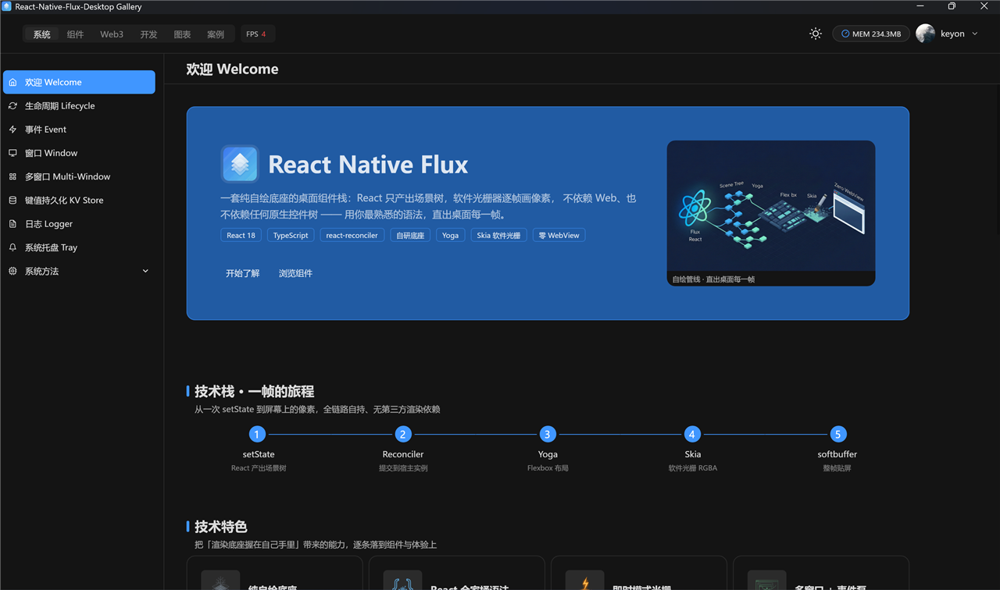
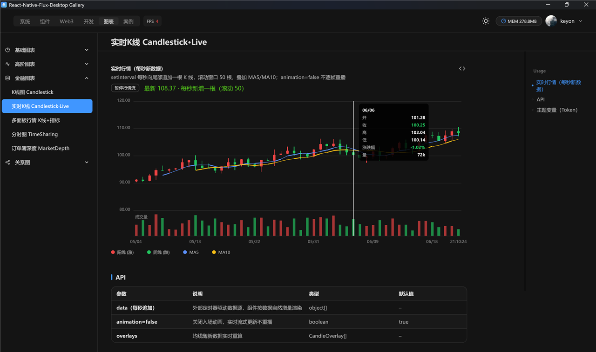
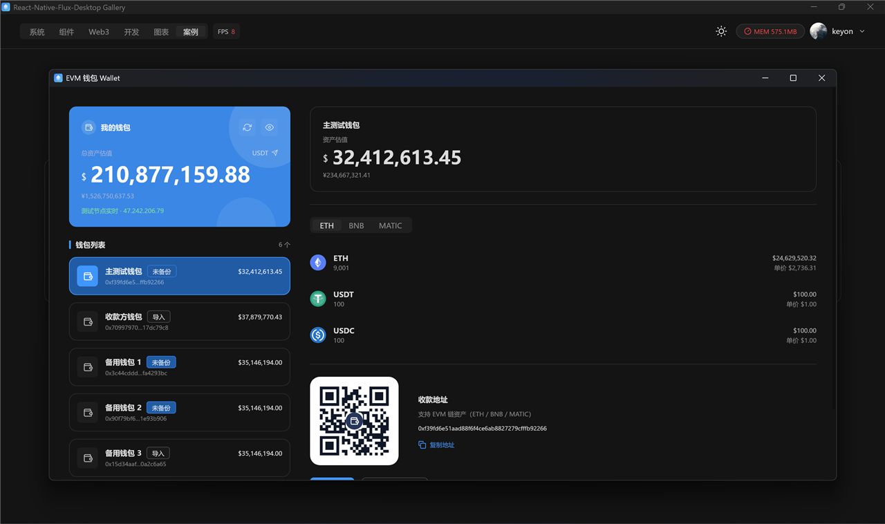
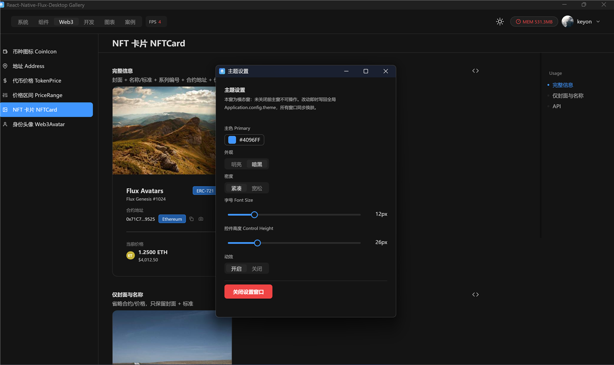

# react-native-flux-desktop（中文）

[English](./README.md) | **简体中文**

<p align="center">
  <a href="https://www.npmjs.com/package/react-native-flux-desktop"></a>
  <a href="https://www.npmjs.com/package/react-native-flux-desktop"></a>
  <a href="./LICENSE"></a>
  
</p>

<p align="center">
  
</p>

一个为 React 打造的自包含**桌面渲染栈** —— 不用 Electron、不用 WebView、不用 Qt。

React 元素经由自定义 Reconciler 渲染为场景树，用 **Yoga** 布局，用 **Skia** 绘制，再经 Rust 原生插件呈现到**自研桌面底座**创建的系统原生窗口上。最终产物是一个小巧的、便于打包成独立 `.exe` 的运行时：直接绘制真实像素，可选 CPU 位图管线或 GPU canvas2d 管线，完整支持 DPI 缩放。

> 本仓库是该库的**编译分发包**：预构建的原生插件（`*.node`）、转译后的 JavaScript 与 TypeScript 类型声明。不包含构建工具链，也不包含 Rust/C++ 源码。

## 掠影

<table>
<tr>
<td width="50%"><br/><sub><b>实时币价看板</b> —— 币安 WS 行情：K线 + MACD + 成交量、盘口深度与梯度，全部在一个原生窗口里。</sub></td>
<td width="50%"><br/><sub><b>实时 K 线</b> —— 十字准星 tooltip、均线叠加，每秒新增一根不丢帧。</sub></td>
</tr>
<tr>
<td><br/><sub><b>EVM 钱包案例</b> —— 多链资产、扫码收款，以独立子窗口形态运行。</sub></td>
<td><br/><sub><b>真正的多窗口</b> —— 主题设置是带自己标题栏的原生子窗，悬浮在主窗之上。</sub></td>
</tr>
</table>

## 功能特性

### 渲染与窗口
- 多窗口：创建 / 关闭 / 聚焦 / 居中、尺寸与位置控制、最小/最大尺寸、标题栏边框、最大化 / 最小化、置顶、透明窗口
- 系统托盘：图标更换、悬浮提示、事件回调；任务栏图标经进程级 AppUserModelID 独立设置
- 单实例锁 + 第二实例唤起 IPC（重复打开时唤醒老程序）
- HiDPI 缩放、光标形状控制、系统剪贴板读写、OS 级文件拖放
- 菜单外点监听器（基于屏幕矩形的 click-outside 检测）
- 追加式 **KV 存储**（`kvPut` / `kvGet` / `kvKeys` / `kvCompact`）与分级**文件日志**
- 可选 GPU canvas2d 上下文（`GpuCtx2D`）：文本、路径、SVG path 填充、图片贴图

### 组件库（antd 风格）
- **80+ UI 组件**：Button、Table、ProTable、Form、ProForm、Modal、Drawer、Select、Cascader、DatePicker、Tabs、Menu、Tree、TreeSelect、Transfer、Upload、Steps、Timeline、Calendar、Carousel、ColorPicker、QrCode、Watermark、Skeleton、Splitter、Masonry、Anchor、BackTop、Affix，以及 message / notification / Modal.confirm 命令式 API（就地 contextHolder，无需 portal）…
- **主题系统**：antd 风格 token 金字塔——seed → map → alias → 组件 token，明暗两套算法，`FluxProvider` + `useToken()`
- **图表**：35+ 图表类型，覆盖金融（K 线、盘口深度、分时、指标叠加）、统计（箱线图、小提琴图、直方图、热力图、日历热力图）、关系图（生态树、紧凑树、缩进树、思维导图、组织架构图、流程图、桑基、矩形树图、旭日图）与经典款（折线 / 面积 / 柱 / 饼 / 雷达 / 玫瑰 / 仪表盘 / 漏斗…）
- **动画**：`useSpring`、`useTween`、`FadeIn` / `MoveIn` / `ScaleIn` / `RotateIn`、`Stagger`、`Flip`、`Transition`、序列编排器、缓动预设
- **Web3 组件**：地址 / 币价 / 价格区间 / NFT 卡片 / 生成式头像
- **开发工具族**：终端与 SSH 终端（VT 网格屏）、diff 查看器、JSON 查看器、日志查看器、markdown 与代码块渲染（语法高亮）

## 平台支持

| 平台 | 状态 |
|---|---|
| Windows x64 (MSVC) | ✅ 已提供（`react-native-flux-desktop.win32-x64-msvc.node`） |
| macOS / Linux | ⛔ 暂未支持 |

## 安装

```sh
# 从 npm registry（推荐）
npm install react-native-flux-desktop

# 或从 GitHub 直装（需本机装有 git）
npm install github:keyonByIos/react-native-flux-desktop

# 或本地 file: 依赖
npm install file:../react-native-flux-desktop-pkg --install-links
```

> 使用 `file:` 依赖时务必加 `--install-links`，让 npm 落真实副本而非 junction/符号链接——否则 `react` / Skia 画布等对等依赖的解析会在运行时失败。

运行要求：
- Node.js ≥ 18（N-API ≥ 6）
- `react@18.3.1`（大版本锁定；reconciler 分支与之绑定）
- 以打包形态运行时设置环境变量 `FLUX_PACKAGED=1`
  （将 KV / 日志数据目录指向可写位置）

## 快速上手

```tsx
import {
  render, Window, FluxProvider, View, Text, Button,
} from 'react-native-flux-desktop';

// render() 启动事件泵并提交渲染树；树中每个 <Window>
// 元素对应一扇系统原生窗口。
render(
  <Window title="Hello Flux" width={1280} height={800}>
    <FluxProvider>
      <View style={{ padding: 24 }}>
        <Text>Hello desktop</Text>
        <Button type="primary">Click me</Button>
      </View>
    </FluxProvider>
  </Window>,
);
```

*（`Application` 单例在裸管线之上补充了持久化配置、窗口台账、托盘与日志——
完整 API 以 `dist/src/` 下的类型声明为准。）*

## 示例：Gallery 演示应用

[`example/`](./example) 目录是一个完整的演示应用——120+ 个演示页，覆盖 UI 组件、
图表、动画、多窗口、系统托盘、开发工具与 Web3 组件。它和普通使用者一样
通过安装包消费本库（`import { Button } from 'react-native-flux-desktop'`），
因此也可当作集成冒烟测试。

```sh
cd example
npm install
npm start          # 先 tsc 编译再运行，CPU 位图管线
npm run gpu        # 同一个 Gallery，走 GPU canvas2d 管线
```

运行要求与上文相同（Node.js ≥ 18，Windows x64）。首次启动会打开一个
汇总所有 demo 的窗口；数据与日志写入 `ReactNativeFluxDesktopGallery`
应用目录（`FLUX_APP_DIR`）。

## `app.json` 应用清单

每个 Flux 桌面应用都在**项目根目录**放一份 `app.json`（参考
[`example/app.json`](./example/app.json)）。它是运行时与打包器共享的
唯一事实来源：

| 字段 | 必填 | 用途 |
|---|---|---|
| `name` | ✅ | 应用名——窗口标题、`.exe` 文件名、数据/缓存目录名 |
| `description` | — | 写入 exe 版本资源的 FileDescription |
| `version` | — | 写入 exe 版本资源（自动补齐为 `a.b.c.d` 四段） |
| `icon` | — | 相对项目根的 PNG 图标路径，打包时嵌入 exe（缺省用默认图标） |
| `main` | — | 编译后的入口 JS；缺省回落到 `package.json` 的 `main` |
| `output` | — | 打包产物目录（默认 `build`） |
| `logger` | — | `{ path, level }`——日志根目录（留空→默认数据目录）与最低捕获级别 |
| `allowMultiOpen` | — | 是否允许多实例（否则受单实例锁约束） |

打包器会做硬校验、快速失败：缺 `name`、入口文件不存在、或入口产物比任何
源文件都旧（忘了重新编译）——都会中断打包，并在报错里直接给出修复动作。

## 仓库结构

```
index.js                                   # 原生插件加载器：createWindow / present / kv* / tray / clipboard
index.d.ts                                 # 原生插件的类型声明
react-native-flux-desktop*.node            # 预构建原生插件（win32-x64-msvc）
package.json
dist/src/index.js|d.ts                     # 库入口（package 的 "main" / "types"）
dist/src/{ui,chart,pro,web3,io,dev,...}/   # 编译产物模块，附 .d.ts
example/                                   # Gallery 演示应用源码（依赖已发布包）
```

`dist/src/**` 刻意保留源码目录层级：部分模块以固定相对深度（`../../../index.js`）
引用根加载器，因此该目录树不可扁平化或二次打包。

## 相关仓库

- [react-native-flux](https://github.com/keyonByIos/react-native-flux) —— 父仓库；本包以 git submodule 形式挂在 `packages/react-native-flux-desktop`。

## 许可证

[MIT](./LICENSE)
